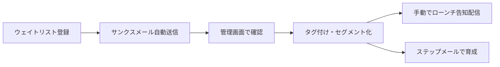

# FirstPen Waitlist System v2

日本初のAIツール専門マーケットプレイス **FirstPen** のウェイトリスト管理システム。

```
┌─────────────────────────────────────┐
│  既存サイト (firstpen-platform...)   │
│  <script src=".../widget.js">       │ ← JSウィジェット (script一行)
└──────────────┬──────────────────────┘
               ▼ POST /api/waitlist
┌─────────────────────────────────────┐
│  Cloudflare Workers                  │
│  ├ /widget.js          公開          │
│  ├ /api/waitlist       公開          │
│  ├ /api/sendgrid/webhook  公開       │
│  └ /api/admin/*        Basic認証     │
└──────┬──────────────────────┬───────┘
       ▼                      ▼
┌──────────────┐      ┌──────────────────┐
│ Cloudflare D1│      │ SendGrid v3 API  │
│ (subscribers,│      │  (送信/Webhook)  │
│  tags,       │      └──────────────────┘
│  templates,  │
│  campaigns,  │
│  step_flows, │
│  events)     │
└──────────────┘
       ▲
       │ Basic認証
┌──────┴──────────────────────────────┐
│  管理画面 (GitHub Pages)              │
│  ・📊 ダッシュボード (登録推移/開封率) │
│  ・👥 登録者一覧/検索/CSV/タグ管理     │
│  ・📄 テンプレート (HTMLプレビュー)    │
│  ・📣 手動メール送信 (セグメント配信)   │
│  ・⏱  ステップメール (SendGrid連携)    │
│  ・🏷  タグ・セグメント                │
│  ・⚙️  設定                           │
└─────────────────────────────────────┘
```

## ✨ 機能一覧

| 機能 | 詳細 |
|---|---|
| **JSウィジェット埋め込み** | `<script src=".../widget.js">` 1行で既存ページに登録フォームを設置 |
| **D1データベース** | SQLite互換、高速検索、無料5GBまで |
| **Basic認証管理画面** | ID/PWで保護されたSPAダッシュボード |
| **登録者一覧/検索** | メール/名前/属性/タグ/ステータスで絞り込み |
| **CSV出力** | フィルタ条件のままCSVダウンロード (Excel対応BOM付) |
| **タグ管理** | カラー付きタグでグルーピング (登録時に属性ベース自動付与) |
| **HTMLテンプレート** | エディタ＋リアルタイムプレビュー (iframe) |
| **手動メール送信** | タグ/属性で絞ってバッチ送信 (個別変数差し替え) |
| **ステップメール** | 多段ステップ定義 + SendGrid Automation連携 |
| **配信統計** | 開封率/クリック率/バウンス率を自動集計 |
| **Event Webhook** | SendGridからのイベントを自動でDB記録 |

## 📁 ディレクトリ構成

```
firstpen-waitlist-v2/
├── workers/                         # Cloudflare Workers API
│   ├── src/
│   │   ├── index.js                 # エントリ・ルーティング
│   │   ├── public-api.js            # 公開API (登録・Webhook)
│   │   ├── admin-api.js             # 管理API (Basic認証)
│   │   ├── widget.js                # 埋め込みJSウィジェット
│   │   ├── sendgrid.js              # SendGrid APIラッパー
│   │   ├── templates.js             # メールテンプレート
│   │   └── utils.js                 # 共通ユーティリティ
│   ├── migrations/
│   │   └── 0001_init.sql            # D1スキーマ
│   ├── wrangler.toml
│   └── package.json
│
├── admin/                           # 管理画面 (GitHub Pages)
│   ├── index.html
│   ├── style.css
│   └── app.js                       # SPA本体
│
├── widget/
│   └── example-embed.html           # 埋め込みサンプル
│
├── docs/
│   └── SETUP.md                     # セットアップ手順
│
├── .github/workflows/
│   ├── deploy-pages.yml             # 管理画面の自動デプロイ
│   └── deploy-workers.yml           # Workers の自動デプロイ
│
└── README.md
```

## 🚀 クイックスタート

詳細は [`docs/SETUP.md`](docs/SETUP.md) を参照。

### 1. SendGrid準備
- アカウント作成 → Sender Authentication → API Key発行 (Mail Send権限)

### 2. Cloudflare準備
```bash
cd workers
npm install
npx wrangler login

# D1データベース作成
npx wrangler d1 create firstpen-waitlist
# → 出力されたdatabase_idを wrangler.toml に記入

# マイグレーション実行
npx wrangler d1 migrations apply firstpen-waitlist --remote

# シークレット登録
npx wrangler secret put SENDGRID_API_KEY
npx wrangler secret put FROM_EMAIL
npx wrangler secret put ADMIN_EMAIL
npx wrangler secret put ADMIN_PASS

# デプロイ
npx wrangler deploy
# → https://firstpen-waitlist-api.<subdomain>.workers.dev を取得
```

### 3. 管理画面の設定
- `admin/app.js` の `DEFAULT_API_BASE` を上記URLに更新
- GitHub Pages を有効化してデプロイ
- 管理画面を開く → ブラウザがBasic認証ダイアログを表示 → ADMIN_USER/PASSでログイン

### 4. 既存ページにウィジェット埋め込み
既存の `firstpen-platform.vercel.app/waitlist.html` の任意の位置に:
```html
<div data-firstpen-form data-theme="dark"></div>
<script src="https://firstpen-waitlist-api.<subdomain>.workers.dev/widget.js" defer></script>
```

### 5. SendGrid Event Webhook設定 (任意)
SendGrid Dashboard → Settings → Mail Settings → Event Webhook で以下を設定:
```
URL: https://firstpen-waitlist-api.<subdomain>.workers.dev/api/sendgrid/webhook
イベント: delivered, open, click, bounce, dropped, unsubscribe, spamreport
```

## 🎯 推奨運用フロー



## 💰 月額コスト目安

| サービス | プラン | 月額 |
|---|---|---|
| GitHub Pages | Free | ¥0 |
| Cloudflare Workers | Free (10万req/日) | ¥0 |
| Cloudflare D1 | Free (5GBストレージ、500万行/日読取) | ¥0 |
| SendGrid | Free (100通/日) | ¥0 |
| **合計** | | **¥0** |

3,000人規模まで完全無料で運用可能です。ローンチ告知の一斉配信時のみSendGridを一時的にEssentials (¥約1,500/月) にアップグレードすれば十分です。
